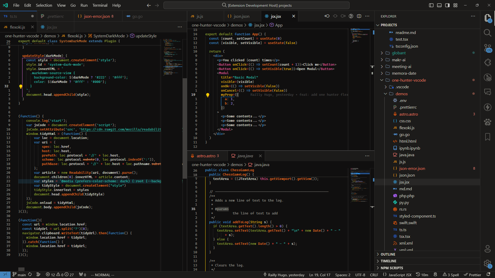
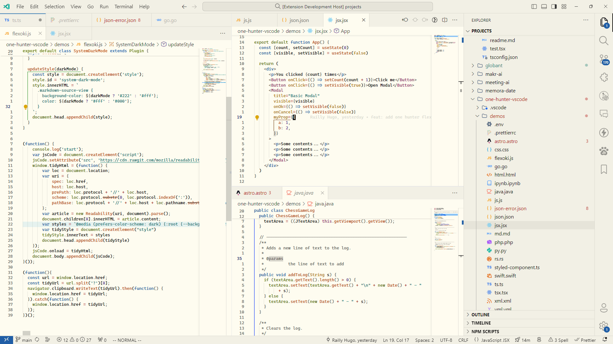

# Flexoki for Visual Studio Code

Created from the main repo [kepanos Flexoki](https://github.com/kepano/flexoki).

To develop (and use) locally, clone this repo into you VSCode extensions folder.

```bash
git clone https://github.com/Bjorn-Eric-Abr/VSCode-Flexoki ~/.vscode/extensions/flexoki
```

## Flexoki Dark



## Flexoki Light


